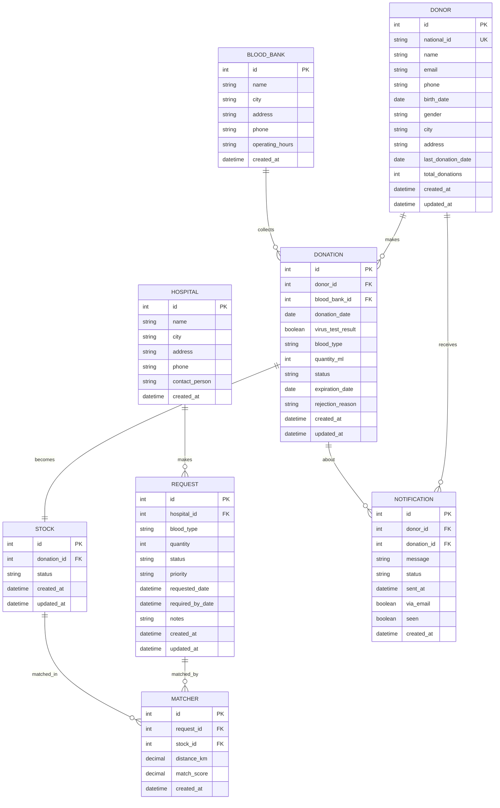

# Cyclic Blood Donation System

Welcome to **Cyclic Blood**, a blood donation system developed by Ahmed Soliman Ghonaim.

- **Root Directory:** `dono system`

---

## Entity Relationship Diagram

---

http://127.0.0.1:8080/api/register/

for testing register donor
{
  "user": {
    "username": "donor_user1",
    "email": "donor1@example.com",
    "password": "donorpass123",
    "role": "donor",
    "city": "Cairo"
  },
  "donor_profile": {
    "national_id": "12345678901234",
    "name": "Ahmed Donor",
    "email": "donor1@example.com",
    "city": "Cairo",
    "phone": "01012345678"
  }
}

for testing register hospital 

{
  "user": {
    "username": "hospital_user1",
    "email": "hospital1@example.com",
    "password": "hospitalpass123",
    "role": "hospital",
    "city": "Alexandria"
  },
  "hospital_profile": {
    "name": "Alex General Hospital",
    "address": "123 Street, Alexandria",
    "phone": "01098765432"
  }
}

